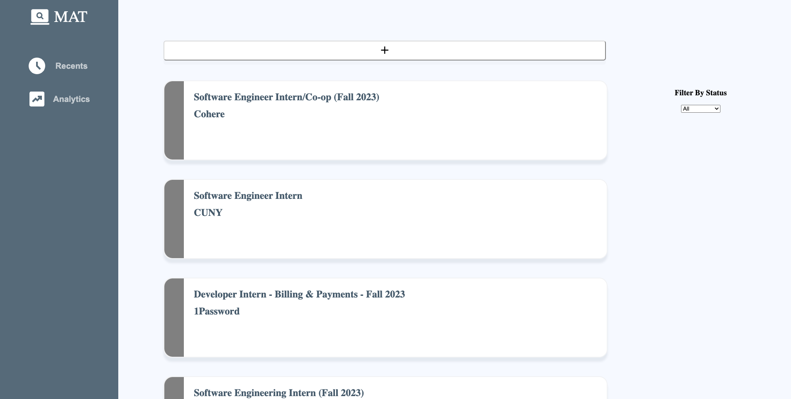

# Job Tracker Web Application

## Project Description

A full-stack web application created with PERN (Postgres, Express, React, Node) in TypeScript that allow users to create, view, update, and delete items from their job tracker through a RESTful API and Postgres database

## Technologies

[<code></code>](https://www.typescriptlang.org/)
[<code></code>](https://www.postgresql.org/)
[<code></code>](https://expressjs.com/)
[<code></code>](https://reactjs.org/)
[<code></code>](https://nodejs.org/en/)

## Demo


## Run locally

0. Install Docker Desktop and or CLI

   [Docker.com](https://www.docker.com/)

1. Clone this repository to your local machine

   ```bash
   git clone https://github.com/112523chen/Job-Application-Tracker-Web-App.git
   ```

2. Open the Root of the Clone within Terminal Run the Following Command in Terminal

   ```bash
   docker build -t client ./client && docker compose up -d && docker run -rm -p 5173:5173 -d client
   ```

3. Open the Following Link in Browser
   
   [http://localhost:5173/](http://localhost:5173/)

## Troubleshooting

> If port any of the ports (5173, 5432, 3001) please go through the project and change the ports to unused ports
